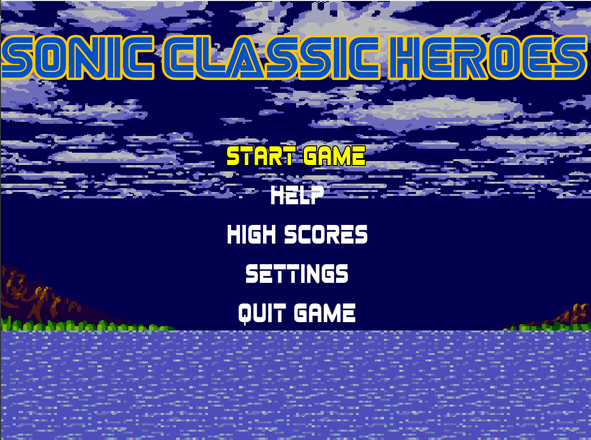
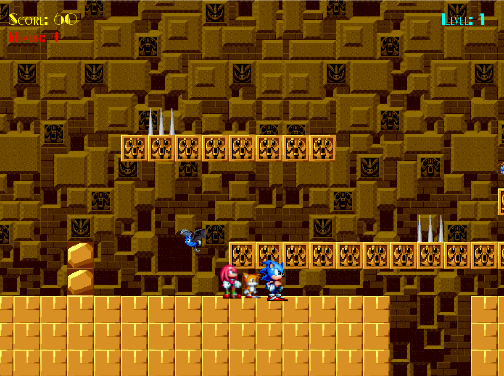
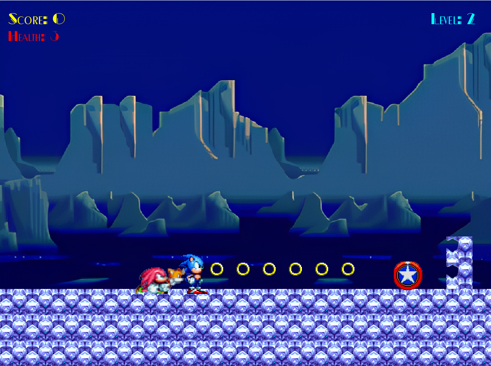
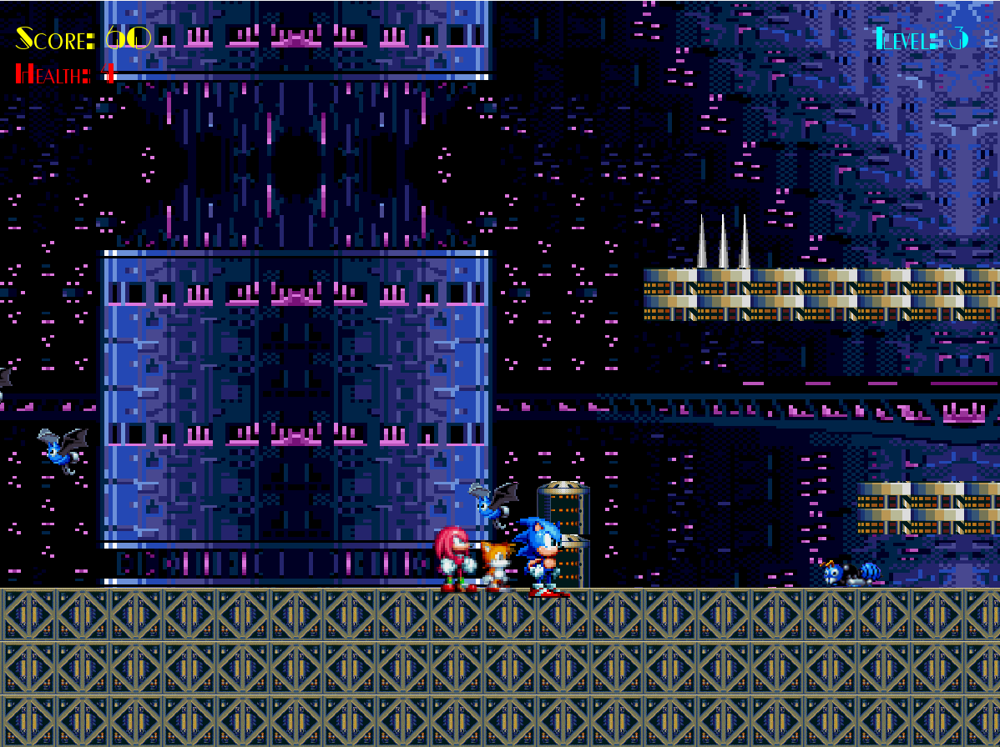

# Sonic Classic Heroes

<div align="center">


**Lightning-fast platforming action with Sonic, Tails, and Knuckles!**

*Control all three heroes at once • Switch on the fly • Conquer three challenging zones*

</div>

---

## 🎮 What Is This?

**Sonic Classic Heroes** is a fast-paced 2D platformer that brings the classic Sonic experience to life with a twist—control Sonic, Tails, and Knuckles **simultaneously**! All three heroes follow you as you blast through zones, with instant character switching to unleash each hero's unique abilities.

Built with **C++** and **SFML**, featuring a clean header-only architecture that makes the codebase elegant and easy to understand.

---

## ✨ Key Features

### 🚀 **Triple Threat Gameplay**
Switch between Sonic, Tails, and Knuckles instantly mid-gameplay. Each hero follows behind with intelligent AI, jumping obstacles and maintaining formation automatically. Experience the ultimate team dynamic!

### 🗺️ **Three Distinct Zones**
- **Labyrinth Zone** (Easy) - Ancient ruins with responsive controls
- **Ice Cap Zone** (Medium) - Slippery ice physics with momentum-based movement
- **Death Egg Zone** (Hard) - Low-gravity space station platforming

### 🎯 **Smooth Platforming Physics**
- Variable jump height (tap vs hold)
- Coyote time for forgiving ledge jumps
- Multiplicative friction for realistic deceleration
- Air control and skid mechanics

### 🤖 **Four Enemy Types**
Face off against BatBrain, BeeBot, Motobug, and CrabMeat—each with unique movement patterns, attack behaviors, and HP systems.

### 💎 **Collectibles & Power-ups**
- **Rings** - Animated collectibles that award points
- **Extra Lives** - Hovering health pickups
- **Special Boost** - Character-specific power-ups

---

## 🦸 The Heroes

| Character | Speed | Special Ability |
|-----------|-------|-----------------|
| **Sonic** | ⚡ Fastest | Speed Boost (3x speed for 15s) |
| **Tails** | 🌀 Balanced | Flight (7 seconds with vertical control) |
| **Knuckles** | 💪 Powerful | Wall Breaking (destroys breakable walls) |

**Shared Health System** - All three heroes share a health pool (3-9 hearts). When hit, you gain 1 second of invincibility frames.

---

## 🕹️ Controls

| Action | Key |
|--------|-----|
| Move | `←` `→` |
| Jump | `Space` |
| Switch Character | `Z` |
| Special Ability | `Left Ctrl` |
| Fly Up/Down (Tails) | `W` / `S` |

---

## 🎮 Gameplay Highlights

- **Smart AI Followers** - Computer-controlled heroes automatically follow, jump obstacles, and teleport back if they fall behind
- **Horizontal Camera Scrolling** - Screen follows player movement smoothly
- **Respawn System** - Fall into a pit? Respawn on the nearest solid ground 2 blocks behind
- **Obstacle Variety** - Bottomless pits, spikes, platforms, and breakable walls
- **Menu System** - SEGA-style intro animation and level selection

---

## 🛠️ Getting Started

### Prerequisites
- C++17 compiler
- SFML 2.5+ ([Download here](https://www.sfml-dev.org/download.php))
- Visual Studio 2019+ (recommended)

### Build Instructions

```bash
# Clone the repository
git clone https://github.com/zainulaabdin01/sonic-classic-heroes.git
cd sonic-classic-heroes

# Compile (example with g++)
g++ Game.cpp -o sonic-heroes -lsfml-graphics -lsfml-window -lsfml-system -lsfml-audio
```

**Important:** Make sure the `Data/` folder is in the same directory as your executable!

### Project Structure

```
sonic-classic-heroes/
├── Game.cpp              # Entry point
├── GameManager.h         # Main game loop
├── menu.h                # Menu system
├── Player.h              # Base player class
├── Sonic.h / Tails.h / Knuckles.h
├── Level.h / Levels.h    # Zone implementations
├── Enemy.h               # Enemy classes
├── Collectible.h         # Items (Rings, Extra Lives, etc.)
└── Data/                 # Assets (sprites, audio, fonts, levels)
```

---

## 🎨 Technical Details

- **Header-Only Architecture** - Clean, modular design
- **Grid-Based Level System** - Levels loaded from text files
- **Physics Configuration** - Unique physics per zone
- **60 FPS Target** - Optimized rendering with camera culling
- **Dynamic Enemy Spawning** - Randomized enemy placement

---

## 🎯 What's Included

✅ Three playable characters with unique abilities  
✅ Three complete zones with distinct physics  
✅ Four enemy types with AI behaviors  
✅ Collectible system (rings, lives, power-ups)  
✅ Smart follower AI system  
✅ Character switching mechanics  
✅ Menu system with level selection  
✅ Horizontal camera scrolling  
✅ Health and scoring systems  

---

## 📸 Screenshots

### Main Menu

*SEGA-style menu with level selection and settings*

### Labyrinth Zone (Level 1)

*Ancient ruins with standard physics - Easy difficulty, 200×14 cells*

### Ice Cap Zone (Level 2)

*Frozen tundra with slippery ice physics - Medium difficulty, 250×14 cells*

### Death Egg Zone (Level 3)

*Space station with low gravity - Hard difficulty, 300×14 cells*

